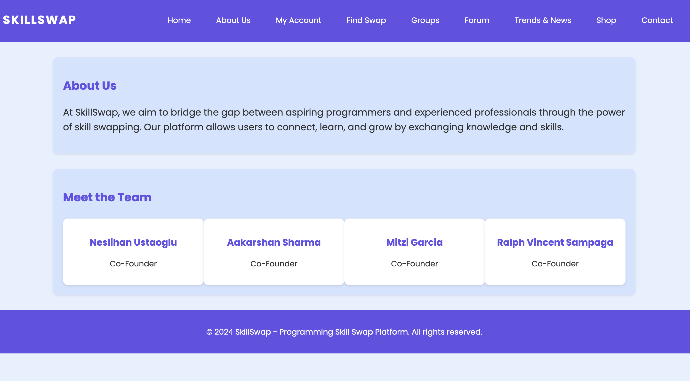

# Fundamentalas of JavaScript _ 2024 Fall _ Group 9 _ Group Project

# Computer Programming Skill Swap Platform

Welcome to the Computer Programming Skill Swap Platform! This platform is designed to help programmers of all levels exchange skills, share knowledge, and collaborate with others in the field of computer programming. It connects learners and experienced developers in a mutually beneficial environment to swap skills for free or for a fee.

## Table of Contents

- Project Overview
- Main Features
- Technologies
- Installation Instructions
- Usage
- Team Members & Contributions
- Project Workflow
- Development Phases
- Challenges & Solutions
- Links & Resources
- Screenshots

## Project Overview

### Purpose

The Computer Programming Skill Swap Platform aims to solve the problem of finding personalized learning opportunities for computer programmers. Users can exchange skills with others through virtual sessions, avoiding high tutoring costs. The platform focuses on skill-sharing rather than traditional mentorship, offering tools for collaboration, reviews, and feedback.

### Key Features

* **User Profile Pages:** Users can create and manage profiles with skill listings, expertise levels, and teaching packages.
* **Skill Matching:** Interactive charts and filters suggest potential skill-swap partners.
* **Swap Scheduling:** A calendar system allows users to schedule and confirm swap sessions.
* **Rating & Review System:** Users can rate their swap sessions, providing feedback to others.
* **Groups & Forums:** Create or join groups, participate in discussions, and learn in a collaborative environment.
* **News & Trends:** Stay updated with the latest programming trends, tutorials, and resources.
* **Secure Payment Gateway:** A secure payment system for users who wish to sell their educational materials.

### Main Features

* **User Registration & Login:** Secure authentication system for user registration and login.
* **Interactive Skill Matching:** Filters to sort potential swap partners based on programming languages, frameworks, and experience levels.
* **Booking & Scheduling System:** Users can set their availability and request swap sessions via an integrated calendar.
* **Review System:** After each swap, users can rate the session and provide feedback.
* **Forum:** A community-driven discussion forum where users can ask questions and share experiences.
* **Groups:** Users can form or join study groups based on their learning interests.
* **Shopping:** Users can purchase or sell coding materials through the platform’s online store.

### Video Presentation of the Project

https://www.youtube.com/watch?v=D1hvewGAaek

### Technologies

The platform is built with the following technologies:

- Frontend: HTML, CSS, JavaScript
- Interactive Functionality: Node.js, JavaScript, React.js
- Deployment: GitHub Pages for hosting
- Version Control: GitHub (with branching strategies for development, testing, and deployment)
- Automation Testing: Selenium, Cucumber, Playwright (will be implemented in the future versions)

### Installation Instructions

To get started with the Computer Programming Skill Swap Platform locally, follow these steps:

To clone the repository:

GitHub repository: https://github.com/NesliHumber/group9_project.git
Install dependencies: Ensure you have Node.js and npm installed

To use the application:

GitHub Pages Live URL: https://neslihumber.github.io/group9_project/ 

### Usage

Once the platform is up and running, you can:

- Sign Up: Create a user account to get started.
- Profile Management: Add skills, set & display your expertise level via total swaps - skills learned - skills taught sections, and start connecting with others via swaps and messages.
- Skill Swap: Browse potential partners and schedule swap sessions.
- Participate in Groups: Create new group or participate existing groups realted to specific topics for better engagement.
- Engage in Discussions: Participate in the forums related to specifc topics or search through forums for any information.
- Shop: Browse & purchase or sale programming materials or educational resources.

### Team Members & Contributions

#### Neslihan Ustaoglu (JavaScript Developer & Documentation Specialist & Manual Tester)

- Developed and maintained project documentation including
    - project plan,
    - Project Phase 1 - Development Checkpoint
    - Project Phase 2 - Development Phase Progress Report
    - Development of README.md file
- Created and updated GitHub Issues, GitHub Project Board
- Conducted and maintained branch strategy, handling pull request reviews, possible merge conflicts, any other issues encountered 
    - Maintained branching strategy as follows:
        - For functionality development seperate **feature/<feature-name>** branch for every functionality
        - For development track **develop** branch
        - Conducting deployment via seperate **deploy** branch
- Developed nd worked on:
      - MyAccount page
      - Groups page
      - Sign Up, Sign In, Sign Out functionalities
- Added responsive design adaptable to various devices
- Used feature/deploy, feature/user_dashboard, feature/groups_page branches
- Performed manual testing to ensure platform functionality

#### Mitzi Garcia (JavaScript Developer & UI/UX Designer & Social Media Manager & Manual Tester)

- Developed the layout and styling of the platform, ensuring user accessibility and a responsive design
- Ensured consistent layout and styling across all pages and application functionalities
- Developed:
      - Homepage
      - Forums page
      - Seperate development of each forum categories page
- Worked on:
      - UI Design and Overall Website Design Consistency
      - Homepage development with its adaptive design to various devices
      - Development of forum page with 4 active forums, their connections to actual seperate topic-related forum categories
- Added responsive design adaptable to various devices
- Used feature/forums_page and feature/home_page branches
- Performed manual testing to ensure platform functionality

#### Aakarshan Sharma (JavaScript Developer & Manual Tester)

- Developed the layout, interactivity, and functionality of the following pages:
    - About Us page: Designed a clean, professional layout introducing the platform and its mission.
    - Trends & News page: Created a dynamic page showcasing IT-related news with card-based sections and external resource links.
    - Shop page: Implemented product display grid, interactive cart system, wishlist functionality, search bar, and sorting features.
- Ensured design consistency and responsiveness across all developed pages, maintaining alignment with the overall theme of the platform.
- Used feature/about_us, feature/trends_and_news, and feature/shop_page branches.
- Performed manual testing to validate page responsiveness, functionality, and user interactivity.

#### Ralph Vincent Sampaga (JavaScript Developer & Manual Tester)

- Developed Find Swap and Contact pages
- Used feature/find_swap_page, feature/contact_page branches
- Performed manual testing to ensure platform functionality

### Project Workflow

#### GitHub Repository

  https://github.com/NesliHumber/group9_project.git

#### Branches:

  + main
  + deploy
  + develop
  + feature/forums_page
  + feature/groups_page
  + feature/shop_page
  + feature/find_swap_page
  + feature/home_page
  + feature/about_us
  + feature/contact_page
  + feature/trends_and_news
  + feature/user_dashboard
  + feature/sign_up
  + feature/sign_in

* **main:** The main branch where the stable code resides.
* **develop:** Used for integrating all features before deployment.
* **deploy:** Used for deploying all functionalities before transfering the codes to main branch.
* **feature/<feature-name>:** Page-specific branches for development.
* **Pull Requests:** Changes are merged into the develop branch via pull requests, with at least one peer review required for approval.

### Issues & Project Board:

* 10 issues are created and closed after functionality development.
* GitHub issues (closed) link: https://github.com/NesliHumber/group9_project/issues?q=is%3Aissue+is%3Aclosed 

* The project board is used to manage tasks and progress. 
* Project Board Link: https://github.com/users/NesliHumber/projects/1/views/2

### Development Phases

* Phase 1: Setup repository, implement user registration, and initial profile management.
* Phase 2: Develop skill matching, swap scheduling, and user dashboard functionalities.
* Phase 3: Add rating/review system, forums, and shop page.
* Phase 4: Manual testing, deployment, and bug fixing.

### Challenges & Solutions

* **Challenge 1:** Integrating the Swap Scheduling Feature
* **Solution**: We researched different calendar libraries and successfully integrated a custom solution to handle date/time selection and swap session confirmations.

* **Challenge 2:** Payment Gateway Integration
* **For future versions:** we search for a secure payment provider to integrate our user-friendly checkout flow to ensure smooth payment processing.

* **Challenge 3:** Since deployment of the web site was the main goal for this phase, the process of incorporating the feature/branch folders into deployment process was the main challenge for this phase. 
* **Solution:** We decided to continue our functionality development process via pushing separate feature/<feature-name> branches per web page and creating pull request from these branches to the develop branch on the remote. For the deployment, we decided to create a separate deploy branch on the remote and we added last version of every functionality to deploy branch. Our website deployment is rooting from this deploy branch until future version upgrades.

* **Challenge 4:** Connecting all pages together under navigation bar interactively via active URL absolute paths was the second challenge during development process. 
* **Solution:** Our strategy is to use the same navigation bar codes inside every page with a common .css styling.

### Links & Resources

* **GitHub Repository:** [group9_project](https://github.com/NesliHumber/group9_project.git)
* **Project Board:** GitHub Project Board: https://github.com/users/NesliHumber/projects/1/views/2
* **Deployment:** The project is hosted on GitHub Pages. Visit the live version at: [https://neslihumber.github.io/group9_project/](https://neslihumber.github.io/group9_project/)
*  **Video Presentation:** https://www.youtube.com/watch?v=D1hvewGAaek

### Future Enhancements:

- Creating a sign up page which connects to MyAccount page after new user registration
- Creating a new group based on a specifc topic to be an alternative to existing groups
- Development of shopping cart display page including shipment & billing address
- Integration of shopping cart display page with a secure payment provider
- Integration with coding challenge platforms (e.g., LeetCode, Codewars).
- Support for video conferencing tools for virtual sessions.
- More personalized skill suggestions using AI/ML models.
- Implementing automation testing via Selenium-Cucumber-Playwright for enhanced quality assurance

### Screenshots

Here are some screenshots of the platform to give you a better idea of the user interface and features:

**Homepage:**

**About Us**

**User Dashboard:**

**Forum:**

**Skill Matching:**

**Shop Page:**

